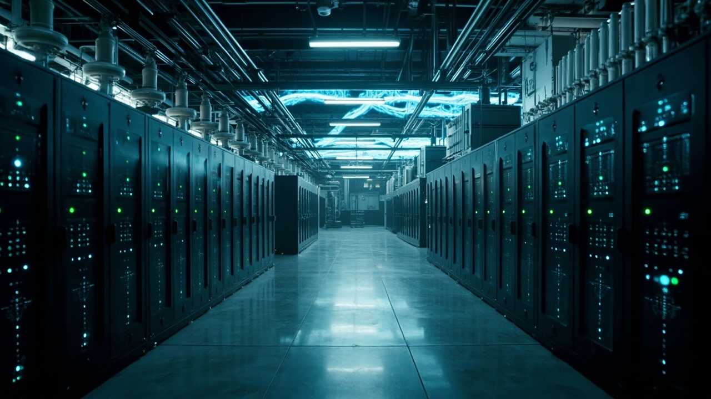

# Archived LinkedIn Content Bundle

- Primary category: AI算力基础设施地缘风险
- Generated at: `2026-05-02T13:17:21Z`
- Image status: `generated`
- Image provider: `minimax`
- Image model: `image-01`
- Image file: `category_1_ai_infrastructure_risk_run_20260502_211721_8f9c3f87.jpg`

---
# Category 1: AI Infrastructure Geopolitical Risk

> 使用环节：阶段五 - LinkedIn决策简报生成。
> Run ID: `run_20260502_211625_abc9cd1e`
> Generated at: `2026-05-02T13:16:25Z`

## Metadata

- Primary category: AI算力基础设施地缘风险
- Target audience: AI infrastructure investors, data center operators, cloud strategy teams, and multinational AI enterprise strategy leaders.
- Tone and positioning: Professional insight plus risk-warning decision brief, written for executives and investors who need infrastructure allocation signals.
- Source news IDs: 1
- Lineage mode: local_sample_baseline
- Prompt version: linkedin_content_generation_v3_stage14_grounded_llm
- Model provider: deepseek:deepseek-v4-flash

## Source Evidence

| News ID | Source mode | Source type | Relevance | Classification confidence | Title |
|---:|---|---|---:|---:|---|
| 1 | local_sample_baseline | institution_report | 9.00 | 0.95 | AI data center expansion raises electricity demand and grid planning risk |

## Factual Validation

- Status: `passed`
- Summary: Passed Stage 14 evidence guard.
- Unsupported numbers: none
- Unsupported named entities/source names: none

## LinkedIn Post

AI data center expansion is driving up electricity demand—and grid planning risks.

What happened:
A sample energy-sector brief highlights that rapid AI data center buildout is increasing electricity demand in several markets. Grid connection delays, competition for power purchase agreements, and local permitting constraints may slow cloud infrastructure expansion.

Why it matters for AI infrastructure:
Compute capacity depends on reliable, affordable power. Grid bottlenecks and energy competition directly affect data center build timelines and operational costs.

Business implications:
• Grid constraints could delay new data center projects, impacting capacity deployment.
• Rising competition for PPAs may increase energy costs for operators.
• Regional regulatory differences in permitting and energy resilience will shape site selection decisions.

Signals to watch:
• Power availability trends in key AI infrastructure markets.
• Changes in regional permitting and grid connection regulations.

Closing question:
How are you factoring grid resilience into your AI infrastructure deployment decisions?

#AIDataCenters #GridRisk #InfrastructureDecisions

## Image Generation Prompt

A 16:9 professional image showing a sleek data center corridor with rows of server racks on one side, and on the opposite side a high-voltage electrical substation with transformers and power lines, connected by subtle glowing blue energy streams, representing the interdependence between AI compute infrastructure and grid capacity. Clean, futuristic style, no logos or text overlays, no sensational crisis imagery.

## Quality Self-Check

| Dimension | Score |
|---|---:|
| Domain relevance | 25 |
| Decision value | 24 |
| Credibility | 20 |
| Structure clarity | 15 |
| Interaction quality | 15 |
| Total | 99 |
