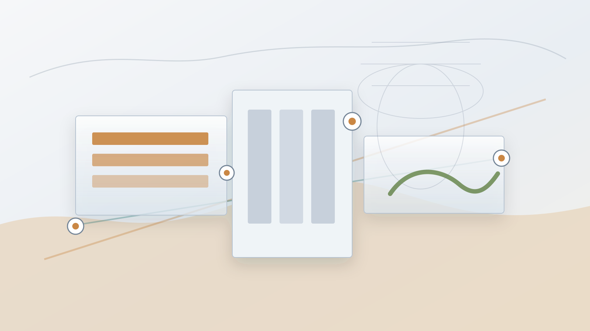

# Archived LinkedIn Content Bundle

- Primary category: AI关键矿产供应链与地缘政治
- Generated at: `2026-05-02T07:49:49Z`
- Image status: `offline_fallback`
- Image provider: `offline_fallback`
- Image model: `deterministic_svg`
- Image file: `category_2_ai_critical_minerals_supply_chain_run_20260502_154949_56f368eb.svg`

---
# Category 2: AI Critical Mineral Supply Chain Geopolitics

> 使用环节：阶段五 - LinkedIn决策简报生成。
> Run ID: `run_20260502_154949_44d1cd7f`
> Generated at: `2026-05-02T07:49:49Z`

## Metadata

- Primary category: AI关键矿产供应链与地缘政治
- Target audience: AI infrastructure investors, commodity investors, and AI enterprise supply-chain leaders.
- Tone and positioning: Deep-analysis executive brief that links mineral supply risk to AI infrastructure cost, timing, and investment decisions.
- Source news IDs: 2
- Prompt version: linkedin_content_generation_v2_stage10_offline_fallback
- Model provider: offline_fallback

## Source Evidence

| News ID | Source type | Relevance | Classification confidence | Title |
|---:|---|---:|---:|---|
| 2 | institution_report | 8.49 | 0.95 | Copper supply concentration creates cost risk for AI infrastructure buildout |

## LinkedIn Post

Copper may be one of the quietest bottlenecks in the AI buildout story.

What happened:
The selected critical-minerals signal is: Copper supply concentration creates cost risk for AI infrastructure buildout. It links rising demand from data centers, power transmission, and semiconductor manufacturing with political risk in key producing regions.

Why it matters for AI infrastructure:
AI compute expansion is physical infrastructure before it is only software. Copper availability can shape grid expansion, data center electrical systems, transmission capacity, and the upstream cost base behind AI infrastructure deployment.

Business implications:
- AI infrastructure cost models should stress-test mineral input inflation and construction delays, not only GPU pricing.
- Investors need to compare compute capacity pipelines with copper, transmission, and permitting bottlenecks.
- Supply-chain teams should monitor regional concentration risk alongside chip and accelerator availability.

Signals to watch:
- Permitting timelines and disruption risk in copper-producing regions.
- Transmission equipment lead times and grid expansion plans in data center markets.
- Policy signals around resource nationalism, export limits, or shipping constraints.

Closing question:
If AI demand keeps moving from model roadmaps into grid-scale construction, should copper risk be treated as a core AI infrastructure KPI rather than a commodity footnote?

#AIInfrastructure #CriticalMinerals #SupplyChain

## Image Generation Prompt

Create a professional 16:9 LinkedIn visual for an executive brief on critical minerals and AI infrastructure. Show copper supply, power transmission lines, semiconductor manufacturing, and data center construction as connected layers of one supply chain. Use a clean editorial business style, no logos, no text overlays, no sensational imagery.

## Quality Self-Check

| Dimension | Score |
|---|---:|
| Domain relevance | 25 |
| Decision value | 24 |
| Credibility | 18 |
| Structure clarity | 15 |
| Interaction quality | 15 |
| Total | 97 |
