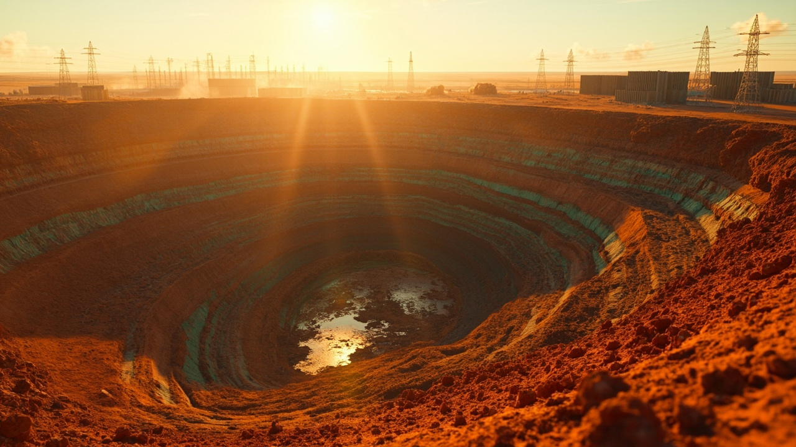

# Archived LinkedIn Content Bundle

- Primary category: AI关键矿产供应链与地缘政治
- Generated at: `2026-05-02T13:17:21Z`
- Image status: `generated`
- Image provider: `minimax`
- Image model: `image-01`
- Image file: `category_2_ai_critical_minerals_supply_chain_run_20260502_211721_8f9c3f87.jpg`

---
# Category 2: AI Critical Mineral Supply Chain Geopolitics

> 使用环节：阶段五 - LinkedIn决策简报生成。
> Run ID: `run_20260502_211625_abc9cd1e`
> Generated at: `2026-05-02T13:16:25Z`

## Metadata

- Primary category: AI关键矿产供应链与地缘政治
- Target audience: AI infrastructure investors, commodity investors, and AI enterprise supply-chain leaders.
- Tone and positioning: Deep-analysis executive brief that links mineral supply risk to AI infrastructure cost, timing, and investment decisions.
- Source news IDs: 2
- Lineage mode: local_sample_baseline
- Prompt version: linkedin_content_generation_v3_stage14_grounded_llm
- Model provider: deepseek:deepseek-v4-flash

## Source Evidence

| News ID | Source mode | Source type | Relevance | Classification confidence | Title |
|---:|---|---|---:|---:|---|
| 2 | local_sample_baseline | institution_report | 8.60 | 0.86 | Copper supply concentration creates cost risk for AI infrastructure buildout |

## Factual Validation

- Status: `passed`
- Summary: Passed Stage 14 evidence guard.
- Unsupported numbers: none
- Unsupported named entities/source names: none

## LinkedIn Post

🔴 Copper supply risk is a hidden variable in AI infrastructure cost.

What happened:
A minerals note highlights that rising copper demand from data centers, power transmission, and semiconductor manufacturing is facing growing political risk in key producing regions. Mine disruptions, permitting delays, resource nationalism, and shipping constraints threaten to raise the cost of AI infrastructure expansion.

Why it matters for AI infrastructure:
Copper availability should be treated as a strategic input for AI compute investment. Without stable supply, data center buildout and semiconductor fabrication could face cost overruns and delays.

Business implications:
• Rising copper costs could increase CapEx for data center construction and power infrastructure.
• Supply chain concentration in geopolitically risky regions adds direct exposure to AI project timelines.
• Strategic stockpiling or diversified sourcing may become necessary for cost predictability.

Signals to watch:
• Permitting reform progress in key copper-producing regions.
• Shipping route disruptions (e.g., chokepoints) affecting copper transport.
• Resource nationalism policies in major mining jurisdictions.

Question for decision-makers:
Is your AI infrastructure investment strategy accounting for copper supply concentration risk?

#AIInfrastructure #CriticalMinerals #GeopoliticalRisk

## Image Generation Prompt

A professional 16:9 image of a copper mine in a rugged desert landscape, with data center servers and power transmission towers in the background, illustrating the link between copper supply and AI infrastructure. Cinematic lighting, realistic photography style, no logos or text overlays.

## Quality Self-Check

| Dimension | Score |
|---|---:|
| Domain relevance | 25 |
| Decision value | 24 |
| Credibility | 20 |
| Structure clarity | 15 |
| Interaction quality | 15 |
| Total | 99 |
