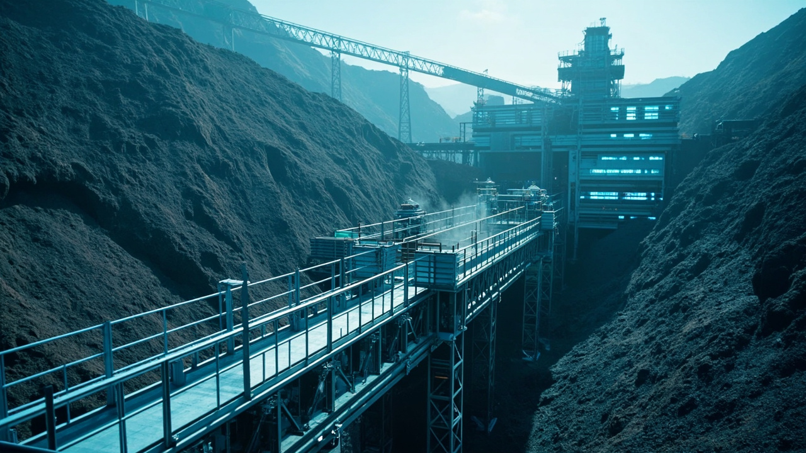

# Daily Candidate Review: AI关键矿产供应链与地缘政治

> Stage 12 output. This is a candidate package for human review only.
> Do not publish externally until the checklist below is completed by a human reviewer.

## Review Metadata

- Daily run ID: `daily_20260502_175846_42f15b3f`
- Run date: `2026-05-02`
- Review status: `pending_review`
- Primary category: AI关键矿产供应链与地缘政治
- Target audience: AI infrastructure investors, commodity investors, and AI enterprise supply-chain leaders.
- Tone and positioning: Deep-analysis executive brief that links mineral supply risk to AI infrastructure cost, timing, and investment decisions.
- Source content ID: `2`
- Source news IDs: 2
- Source titles: Copper supply concentration creates cost risk for AI infrastructure buildout
- Prompt version: `linkedin_content_generation_v2_stage10_llm`
- Model provider: `deepseek:deepseek-v4-flash`
- Original post path: `/Users/jing/Desktop/some_code/GenAI_Coding/Homework2/Homework2/AI_Geopolitical_Risk_Workflow_Homework_Delivery/3-Final_LinkedIn_Content/Category_2_AI_Mineral_SupplyChain_Post.md`
- Stage 11 archive: `/Users/jing/Desktop/some_code/GenAI_Coding/Homework2/Homework2/AI_Geopolitical_Risk_Workflow_Homework_Delivery/3-Final_LinkedIn_Content/archive/2026-05-02/category_2_ai_critical_minerals_supply_chain`

## Human Review Checklist

- [ ] Facts and source titles match the evidence table.
- [ ] No unsupported numbers, quotes, claims, or source names were introduced.
- [ ] Tone is suitable for AI infrastructure investors and enterprise strategy/supply-chain leaders.
- [ ] Business implications are specific enough for decision review.
- [ ] Image is professional, relevant, and free of logos or text overlays.
- [ ] Final decision recorded as approved, revise, or reject before external posting.

## Source Evidence

| News ID | Source | Published | Relevance | Title |
|---:|---|---|---:|---|
| 2 | USGS-style sample mineral note | 2026-04-18 | 9.0 | Copper supply concentration creates cost risk for AI infrastructure buildout |

## Candidate LinkedIn Post

Copper supply risks are becoming a hidden variable in AI infrastructure costs.

What happened:
A recent minerals note highlights rising copper demand from data centers, power transmission, and semiconductor manufacturing, and links it to growing political risk in key producing regions. Mine disruptions, permitting delays, resource nationalism, and shipping constraints are all flagged as potential cost drivers.

Why it matters for AI infrastructure:
Copper is a strategic input for AI compute investment. Supply disruptions directly raise the cost of data center construction, power infrastructure, and semiconductor manufacturing — delaying deployment timelines and eroding margin assumptions.

Business implications:
• Mine disruptions and permitting delays could inflate copper prices, increasing capital expenditure for new data centers and grid upgrades.
• Resource nationalism in key copper-producing regions may force developers to diversify supply sources or accelerate substitution research.
• Shipping constraints add cost and uncertainty to the already complex AI hardware supply chain, especially for power cabling and semiconductor components.

Signals to watch:
• Permitting reform outcomes in major copper-producing countries (e.g., Chile, Peru).
• Political rhetoric around resource nationalism and export controls.
• Shipping route stability, especially in the Pacific and South America.

Closing question:
How is your organization integrating copper supply risk into its AI infrastructure investment thesis?

#AInfrastructure #CriticalMinerals #SupplyChainRisk

## Candidate Visual

- Copied image file: `result/2026-05-02/assets/category_2_ai_critical_minerals_supply_chain_run_20260502_180052_ce409b70.jpg`
- Source image file: `/Users/jing/Desktop/some_code/GenAI_Coding/Homework2/Homework2/AI_Geopolitical_Risk_Workflow_Homework_Delivery/3-Final_LinkedIn_Content/images/category_2_ai_critical_minerals_supply_chain_run_20260502_180052_ce409b70.jpg`
- Image status: `generated`
- Image provider/model: `minimax` / `image-01`

## Image Generation Prompt

Professional 16:9 visual of copper mining operations with clean, modern infrastructure, cool blues and metallic tones, conveying stability and strategic importance, no text overlays, no logos, no crisis imagery.
